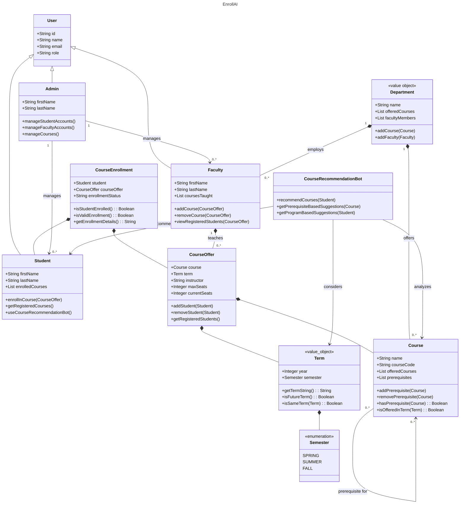

# About 🚀

This Repo is for the final project!

## Project Title
### EnrollAI

## Project Description
```
Our AI-powered course registration platform simplifies the academic planning process by helping students
select courses that align with their academic goals and career aspirations. Using smart algorithms, the
platform suggests personalized course pathways based on department guidelines, prerequisites, and individual
professional objectives, ensuring an efficient and seamless registration experience. With intuitive semester
planning, real-time prerequisite validation, students can confidently chart their path to success while
staying on track for graduation.
```
### Team Member Details

Name: Rutwik Ganagi  
Email Id: ganagi.r@northeastern.edu

Name: Trivikram Bhavesh Budhabhatti    
Email Id: budhabhatti.t@northeastern.edu

Name: Sarthak Deshmukh  
Email Id: deshmukh.sar@northeastern.edu

Name: Payal Jadhav  
Email Id: jadhav.pay@northeastern.edu

# Domain Model for EnrollAI


